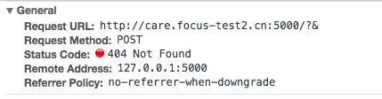

## 1. 前言

当用户在使用ueditor富文本编辑器时，可直接复制粘贴。但是粘贴内容含有图片时，图片地址域名是你复制内容所在的域名，此时最好将图片上传到自己公司CDN，有保障的使用。

此前由后端去匹配表单提交内容中含有的图片，先根据图片``中的src将图片down下来，然后上传到自己的接口，最后将图片地址更换。

这种只由后端处理的方式存在一定性能问题，当用户复制几十张甚至更多图片的时候，后端处理接口超时，导致失败。

此时应该在前端去将远程图片实现本地化的替换，在提交ueditor内容后，省去了后端的替换过程（后端可以保留替换，以便处理漏网之鱼）

## 2.实现

### 远程抓取原理

图片远程抓取是指在插入本地域名之外的图片链接地址时，由服务器将这些外部图片抓取到本地服务器保存的一个功能。实现原理为在编辑器中向服务器发送包含所有 外域图片地址的ajax请求，然后由服务器在后端抓取保存后返回图片地址给编辑器，再由编辑器完成外域地址和本地地址的替换工作。

### ueditor提供的API

ueditor功能介绍： http://www.cnblogs.com/Zell-Dinch/articles/3917827.html

```js
//是否开启远程图片抓取
catchRemoteImageEnable:true,

//处理远程图片抓取的地址
catcherUrl:URL +"server/submit/php/getRemoteImage.php",  

//提交到后台远程图片uri合集的表单名
catchFieldName:"upFile",     

//图片修正地址，同imagePath
catcherPath:fixedImagePath,

//本地顶级域名，当开启远程图片抓取时，除此之外的所有其它域名下的
//图片都将被抓取到本地                                   
localDomain:["baidu.com","10.81.2.114"],
```

但是在`ueditor.config.js`中像上面配置，不管用。

在network中 并没有我设置的catcherUrl


而且catchFiledName 设置的项在 接口字段中也没生效


### ueditor源码

在`ueditor.all.js`中，可看到`catchRemoteImageEnable`开关。


实现的思路如下：
```
1. 监听粘贴事件
2. 取到粘贴内容中的图片，组成一个图片数组
3. 需要后端有对应的接口将 远程图片字符数组转换为自己公司的
4. 将返回的图片地址字符做替换
```
以上是将粘贴的所有图片一次性提交替换，也可能存在超时的情况

所以希望能一张图片一张图片的替换，而且有loading的效果，此时，就自己撸一下

### 手撸

实现思路和ueditor源码实现差不多，主要是一张一张图片替换

在你初始化定义`ueditor`的文件中进行操作

```js
import $$editorServer from 'server/editor'
var imgDomain = 't.img-xxx.cn';

var ue = UE.getEditor('editor', {
    // 设置是否抓取远程图片
    catchRemoteImageEnable: false
    ...
});

// 监听粘贴
// ue.addListener 为ueditor封装的监听事件
ue.addListener("afterpaste", function () {
    // 除去当前域名下、上次粘贴处理过的图片
    var catcherLocalDomain = [imgDomain, "localhost", "xxx.xxx.cn"];
    var remoteImages = [];
    var imgs = UE.dom.domUtils.getElementsByTagName(ue.document, 'img');

    var test = function (src, urls) {
        if (src.indexOf(location.host) != -1 || /(^\.)|(^\/)/.test(src)) {
            return true;
        }
        if (urls) {
            for (var j = 0, url; url = urls[j++];) {
                if (src.indexOf(url) !== -1) {
                    return true;
                }
            }
        }
        return false;
    };
    for (var i = 0, ci; i < imgs.length; i++) {
        ci = imgs[i];
        if (ci.getAttribute("word_img")) {
            continue;
        }
        var src = ci.getAttribute("_src") || ci.src || "";
        if (/^(https?|ftp):/i.test(src) && !test(src, catcherLocalDomain)) {
            remoteImages.push(src);
        } else {
            // 以 imgs 为主 ，为 catcherLocalDomain 指定域名 则不处理
            imgs.splice(i, 1);
        }
    }
    if (imgs.length) {
        that.urlChanged = false;
        // 一次更换一个图片url
        var i, j, ci, cj, oldSrc, newSrc;
        for (i = 0; i < imgs.length; i++) {
            ci = imgs[i];
            oldSrc = ci.getAttribute("_src") || ci.src || "";
            // 闭包处理
            (function(ci){
                // 先展示 loading 图
                var loadingUrl = 'https://3074a34158850.cdn.sohucs.com/bp_2b77f44f051047008f11cfa450d518cc';
                // UE.dom.domUtils 为ueditor封装的操作dom工具
                UE.dom.domUtils.setAttributes(ci, {
                    "src": loadingUrl,
                    "_src": loadingUrl
                });
                var opt = {
                    picUrl: oldSrc
                };
                // 后端接口
                $$editorServer.catchImage(opt, function(r) {
                    if (r.code === 200) {
                        var newSrc = imgDomain + r.data;
                        UE.dom.domUtils.setAttributes(ci, {
                            "src": newSrc,
                            "_src": newSrc
                        });
                    } else {
                        console.error('error:' + r.message);
                        // 若有图片没处理成功 仍然上传老地址 让后端处理，提高容错率，保证功能正常使用
                        UE.dom.domUtils.setAttributes(ci, {
                            "src": oldSrc,
                            "_src": oldSrc
                        });
                    }
                });
            })(ci)
        }
    }

});
```

server/editor.js

```js
import ajax from './fetch'
import config from './config'
let model = {};
/**
 *
 * @desc 非本域图片 替换成 本域图片
 */
model.catchImage = function (params, cb) {
    ajax({
        url: config.mpDomain + '/common/imageUrl/upload',
        type: 'POST',
        data: params,
        headers: {
            'Content-Type':'application/x-www-form-urlencoded'
        },
        withCredentials: true,
        success: function (res) {
            cb && cb(res);
        }
    });
}
export default model;
```

`fetch.js` 是对axios的封装，可参考： https://github.com/careteenL/vue-multi-page/blob/master/src/server/fetch.js
`config.js` 区分本地、测试、线上环境，可参考： https://github.com/careteenL/vue-multi-page/blob/master/src/config.js

## 总结

她那时候还太年轻，不知道所有命运赠送的礼物，早已在暗中标好了价格。
