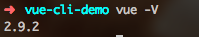
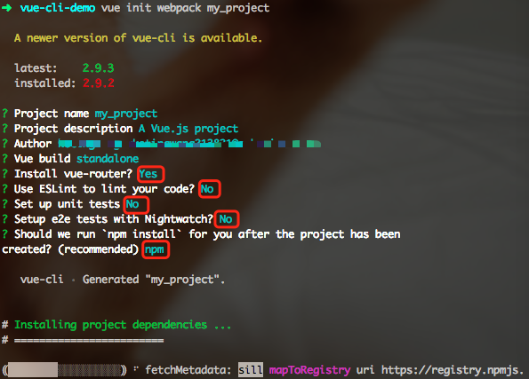
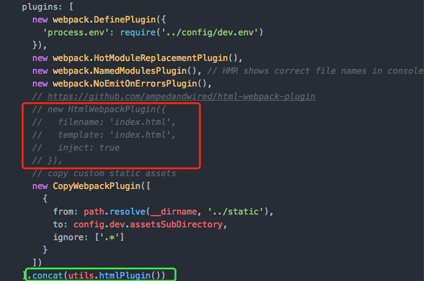
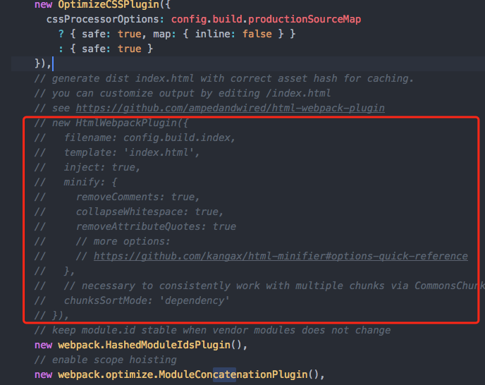
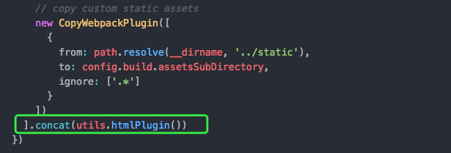
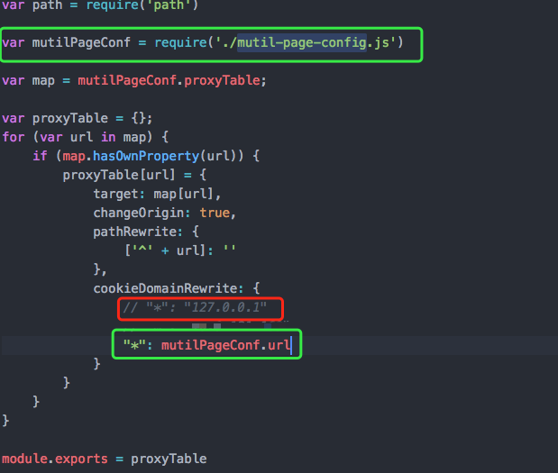
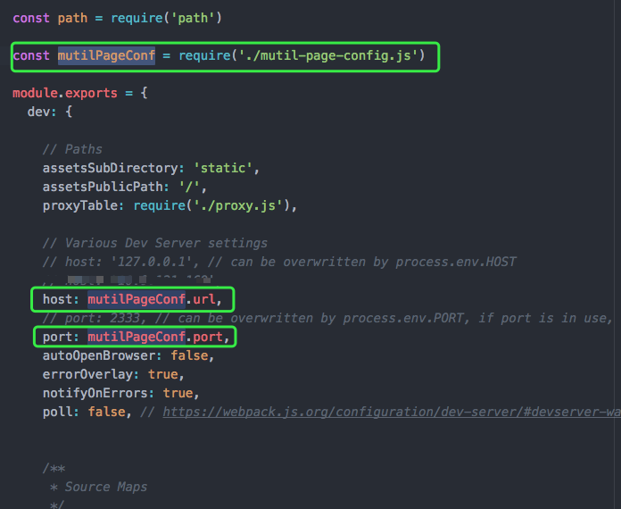
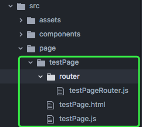

## 1.前言

使用vue-cli脚手架可快速搭建一套单页应用并进行开发，这往往适用于B端项目，访问url、路由等由前端控制，且不需要SEO。

工作环境中可能会有一个场景：需要快速开发出多个交互不多且独立的活动页。此时，应该将其独立成一个新项目，便于后期维护。一个能让我们快速进入开发的脚手架就显得尤为重要。

脚手架地址： https://github.com/careteenL/vue-multi-page

<!-- more -->

## 2. 安装vue-cli

前提条件安装 `node` ，Windows用户前往官网 https://nodejs.org/en/ 下载并傻瓜式安装；Mac用户 iTerm 有自带。

2.1 安装淘宝镜像源
```
npm install -g cnpm --registry=https://registry.npm.taobao.org
```

2.2 安装`webpack`
```
npm install webpack -g
```

2.3 安装`vue-cli`
```
npm install vue-cli -g
```

安装完成后查看版本
```
vue -V
```


2.4 初始化生成项目模板（my_project为项目名称）
```
vue init webpack my_project
```


2.5 安装依赖
```
cd my_project
npm install
```

2.6 启动项目
```
npm run dev
```

## 3. 修改webpack配置
3.1 修改 `build/utils.js`，末尾新增以下代码
```js
// glob是webpack安装时依赖的一个第三方模块，还模块允许你使用 *等符号, 例如lib/*.js就是获取lib文件夹下的所有js后缀名的文件
var glob = require('glob')
    // 页面模板
var HtmlWebpackPlugin = require('html-webpack-plugin')
    // 取得相应的页面路径，因为之前的配置，所以是src文件夹下的page文件夹
var PAGE_PATH = path.resolve(__dirname, '../src/page')
    // 用于做相应的merge处理
var merge = require('webpack-merge')

//多入口配置
// 通过glob模块读取pages文件夹下的所有对应文件夹下的js后缀文件，如果该文件存在
// 那么就作为入口处理
exports.entries = function() {
    var entryFiles = glob.sync(PAGE_PATH + '/**/*.js')
    var map = {}
    entryFiles.forEach((filePath) => {
        var filename = filePath.substring(filePath.lastIndexOf('\/') + 1, filePath.lastIndexOf('.'))
        map[filename] = filePath
    })
    return map
}

//多页面输出配置
// 与上面的多页面入口配置相同，读取page文件夹下的对应的html后缀文件，然后放入数组中
exports.htmlPlugin = function() {
    let entryHtml = glob.sync(PAGE_PATH + '/**/*.html')
    let arr = []
    entryHtml.forEach((filePath) => {
        let filename = filePath.substring(filePath.lastIndexOf('\/') + 1, filePath.lastIndexOf('.'))
        let conf = {
            // 模板来源
            template: filePath,
            // 文件名称
            filename: 'vm/' + filename + '.html',
            // 页面模板需要加对应的js脚本，如果不加这行则每个页面都会引入所有的js脚本
            chunks: ['manifest', 'vendor', filename],
            inject: true
        }
        if (process.env.NODE_ENV === 'production') {
            conf = merge(conf, {
                minify: {
                    removeComments: true,
                    collapseWhitespace: true,
                    removeAttributeQuotes: true
                },
                chunksSortMode: 'dependency'
            })
        }
        arr.push(new HtmlWebpackPlugin(conf))
    })
    return arr
}
```

3.2 修改 `build/webpack.dev.config.js`，plugins中注释红框内容，新增绿框内容。

```js
].concat(utils.htmlPlugin())
```

3.3 修改`build/webpack.prod.config.js`，plugins中注释红框内容，新增绿框内容。


```js
].concat(utils.htmlPlugin())
```

3.4 修改`build/webpack.base.config.js`，entry为
```js
entry: Object.assign({
    'bundle': [
        'babel-polyfill'
    ]
}, utils.entries()),
```

3.5 新增`config/mutil-page-config.js`，集中控制`url`、`port`、`proxyTable`(接口映射)、`pageMap`(页面访问配置)
```js
module.exports = {
    "url": "127.0.0.1",
    "port": "2333",
    "proxyTable": {
        "/xxx": "http://xxx.xxx.cn/xxx"
    },
    "pageMap": {
        "testPage": {
            "aliasPage": "testPage",
            "realPage": "testPage.html"
        }
    }
}

```
3.6 新增`config/proxy.js`


3.7 修改`config/index.js`，配置dev下host、port


3.8 修改 `build/webpack.dev.config.js`，
devServer 中新增 proxy
```js
proxyTable: require('./proxy.js'),
```
新增以下代码，控制dev下前端路由
```js
const mutilPageConf = require('../config/mutil-page-config.js')
// dev-server 下 前端路由
let pageUrlRules = [];
for (let page in mutilPageConf.pageMap) {
    if (mutilPageConf.pageMap.hasOwnProperty(page)) {
        let pageItem = mutilPageConf.pageMap[page];
        pageUrlRules.push({
            from: new RegExp(pageItem.aliasPage),
            to: path.posix.join(config.dev.assetsPublicPath, 'vm/' + pageItem.realPage)
        })
    }
}
```
然后再在`devServer`中配置
```js
rewrites: [...pageUrlRules]
```
## 4. 新增页面

运行下面脚本可在page目录下生成以下几个文件。
```bash
node add-page.js testPage
```


## 5. 封装请求库（axios）

在server目录下新增fetch.js
```js
import axios from 'axios'

/**
 *
 * @desc 封装axios，减少学习成本，参数基本跟jq ajax一致
 * @param {String} type [default: GET]                     请求的类型
 * @param {String} url			                           请求地址
 * @param {String} time  [default: 10s]			           超时时间
 * @param {Object} data		               	               请求参数
 * @param {Boolean} withCredentials  [default: false]	   是否携带cookie
 * @param {String} dataType         		               预期服务器返回的数据类型，xml html json ...
 * @param {Object} headers          		               自定义请求headers
 * @param {Function} success            	               请求成功后，这里会有两个参数,服务器返回数据，返回状态，[data, res]
 * @param {Function} error		                           发送请求前
 * @return {Promise}
 */

let ajax = function (config) {
    let configs = config || {};
    if (!configs.url) {
        console.error('请填写接口地址');
        return false;
    }
    axios({
        method: configs.type || 'get',
        url: configs.url,
        params: configs.data || {},
        header: configs.headers || {
            'Content-Type':'application/x-www-form-urlencoded'
        },
        // baseURL: '',
        withCredentials: configs.withCredentials || false,
        timeout: configs.time || 10 * 1000,
        responseType: configs.dataType || 'json'
    }).then(function(res) {
        if (200 == res.status) {
            if (configs.success) {
                configs.success(res.data, res);
            }
        } else {
            if (data.error) {
                configs.error(error)
            } else {
                console.error('[timeout] 访问人数过多，请稍后重试');
            }
        }
    }).catch(function(error) {
        console.error(error);
        if (configs.error) {
            configs.error(error);
        } else {
            console.error('[timeout] 访问人数过多，请稍后重试');
        }
    });

}
export default ajax;

```

## 6. 区分local、dev、test、prod环境

新增`src/config.js`
```js
/**
 *
 * @desc 全局域名等变量维护
 */

var byProxy = false;
var mainDomain;

/* 本地开发走proxy */
if (/\d+\.\d+\.\d+\.\d+/.test(location.host)) {
    byProxy = true;
}
/* 测试线上等环境 */
if (!byProxy) {
    var hostArr = location.hostname.split('.');
    mainDomain = "." + hostArr[hostArr.length - 2] + '.' + hostArr[hostArr.length - 1];
}
module.exports = {
    mainDomain: byProxy ? "127.0.0.1" : mainDomain,

    testDomain: byProxy ? "" : "//test" + mainDomain
}

```

## 7. CSS工具库

基于Sass的CSS基础库：https://github.com/careteenL/common-ui

## 8. JS工具库

常用js函数： https://github.com/careteenL/webFEDeveloper/blob/master/Util/util.js
